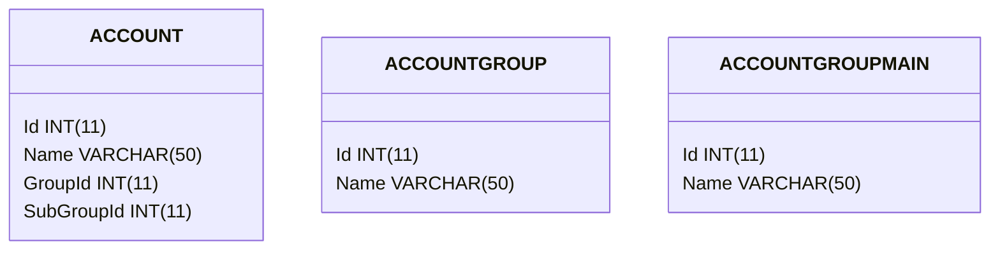

# Finance Section


#### database
                    
#####accounts
DataType  | Variable Name
------------- | -------------
Content Cell  | Content Cell
Content Cell  | Content Cell 
 - accounts
 - accgroups
 - accgroupmain

 ###


```erDiagram
    ACCOUNT {
        Id INT(11) PK
        Name VARCHAR(50)
        GroupId INT(11) FK
        SubGroupId INT(11) FK
    }
    ACCOUNTGROUP {
        Id INT(11) PK
        Name VARCHAR(50)
    }
    ACCOUNTGROUPMAIN {
        Id INT(11) PK
        Name VARCHAR(50)
    }

```



```flow
st=>start: Start s
inp=>start: Start s
sts=>start: Start s
op=>operation: Your Operation
cond=>condition: Yes or No?
e=>end

st->sts->op->cond
cond(yes)->e
cond(no)->op
```


```classDiagram
    class Animal {
        +String name
        +void eat()
    }
    class Dog {
        -int age
        +void bark()
    }
    class Cat {
        -int age
        +void meow()
    }

    Animal <|-- Dog
    Animal <|-- Cat
```
