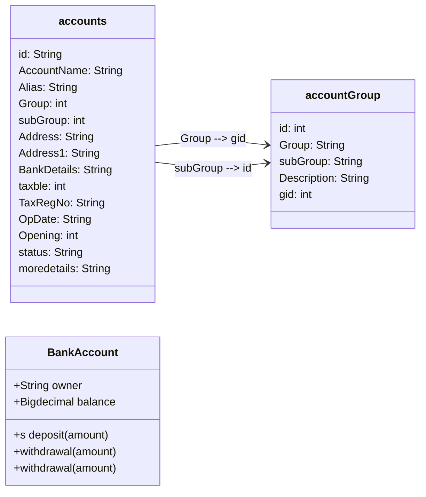

# Finance Section


#### database
 ```mermaid
classDiagram
     MyClass --|> AnotherClass : contains
    class User {
        + int id
        + String name
        + String email
        + List<Post> posts
        + List<Post> posts
    }

    class Post {
        + int id
        + String title
        + String body
        + User user
        + List<Comment> comments
    }

    class Comment {
        + int id
        + String text
        + User user
        + Post post
    }

    User "id" <--> "gid" Post
    Post "1" <--> "*" Comment
 ```                   

```mermaid
  graph LR;
    accounts[("
    <b>accounts</b><br>
    id: String<br>
    AccountName: String<br>
    Alias: String<br>
    Group: int<br>
    subGroup: int<br>
    Address: String<br>
    Address1: String<br>
    BankDetails: String<br>
    taxble: int<br>
    TaxRegNo: String<br>
    OpDate: String<br>
    Opening: int<br>
    status: String<br>
    moredetails: {<br>
      'id'  <br>
    }<br>
     ")]
    accountGroup[("
    <b>accountGroup</b><br>
    id: int<br>
    subGroup: String<br>
    <br>
    gid: int<br>
    Group: String<br>
    <br>
    
    Description: String<br>
     ")]
    accountGroupMain[("
    <b>accountGroupMain</b><br>
    id: int<br>
    group: String<br>
    <br>
    mainhead: String<br>
    debitorcredit: String<br>
    <br>
    
    Description: String<br>
     ")]
     style accounts fill:#f65,stroke:#123,stroke-width:2;
     style accountGroup fill:#f95
     style accountGroupMain fill:#f95

accounts<--Group--gid-->accountGroup
accounts<--subGroup--id-->accountGroup
accountGroup<--gid--id-->accountGroupMain
```


<br>
<br>
<br>
<br>
<br>
<br>
<br>
<br>
<br>
<br>
<br>
<br>
<br>
<br>
<br>



```flow
st=>start: Start s
inp=>start: Start s
sts=>start: Start s
op=>operation: Your Operation
cond=>condition: Yes or No?
e=>end

st->sts->op->cond
cond(yes)->e
cond(no)->op
```
```mermaid
graph LR;
    Start-->Operation;
    Operation-->|Yes|End;
    Operation-->|No|Operation;
 ```   
 
```mermaid
graph LR;
    A["accounts"]-- id -->B["-1"];
    A-- AccountName -->B;
    A-- Alias -->B;
    A-- Group -->B;
    A-- subGroup -->B;
    A-- Address -->B;
    A-- Address1 -->B;
    A-- BankDetails -->B;
    A-- taxble -->B;
    A-- TaxRegNo -->B;
    A-- OpDate -->B;
    A-- Opening -->B;
    A-- status -->B;
    A-- moredetails -->B;
    C["accountGroup"]-- id -->D["1"];
    C-- Group -->D;
    C-- subGroup -->D;
    C-- Description -->D;
    C-- gid -->D;
 ```   

```classDiagram
    class Animal {
        +String name
        +void eat()
    }
    class Dog {
        -int age
        +void bark()
    }
    class Cat {
        -int age
        +void meow()
    }

    Animal <|-- Dog
    Animal <|-- Cat
```
